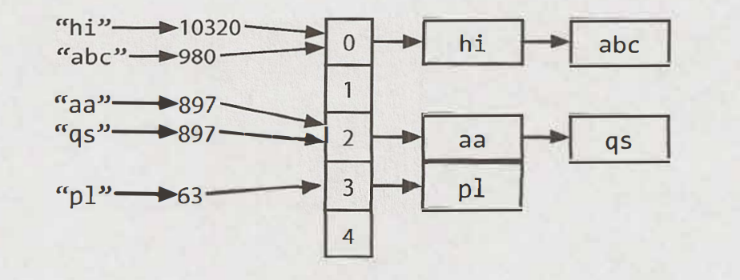

# Arrays and Strings 

**Hash Table** - data structure that maps keys to values for efficient lookup.
- Example: 
To store an array of linked lists in a hash table, we use a key and a value pair.
1. First compute the key's hash code usually `int` or `long`
2. Map the hash code to an index in the array.
3. At this index, there is a linked list of keys and values, store the key and value at this index. We used a linked list because of collisions.

- To retrieve the value pair by its key, compute the hash code from key and compute the index from the hashcode. Then search through the linked list or the value with this key.
- Best case time complexity -> O(1), Worst caste O(n) when collisions are many.
- When we implement a hash table with a balanced binary search tree, lookup time is O(log N)




# ArrayList and Resizable Arrays
- **ArrayList** : an array that resizes itself while stillproviding O(1) access. Typically, when an array is full, the array doubles in size each doubling taking O(n) time.
- **StringBuilder** : Supose you want to concatenate two strings of the same size n, on each concatenation, wo strings are copied overcharacter by character, time complexity is O(xn^2) `x` is length of characters.
 - StringBuilder creates a resizable array of all the strings, copying them back to a string only when necessary.

 ```python
 def join_words(words):
  """Joins a list of words into a single string with spaces between them.

  Args:
      words: A list of strings.

  Returns:
      A string containing all the words joined with spaces.
  """
  sentence = ""
  for word in words:
    sentence += word + " "
  return sentence.strip()

  # Example usage
words = ["hello", "world", "how", "are", "you"]
joined_sentence = join_words(words)
print(joined_sentence) # Output: hello world how are you
 ```
## Questions
1. **Is Unique**: Implement an algorithm to determine if a string has all unique characters. What if you
cannot use additional data structures? 
Time Complexity -> O(n log n)
Space complexity -> O(1)
```python
def is_unique_chars_sorting(string: str) -> bool:
    sorted_string = sorted(string)
    last_character = None
    for char in sorted_string:  
        if char == last_character: # checks if current character 'char' is similar to previous character 'last_character'
            return False
        last_character = char # updates 'last_character' with current character 'char' for next iteration.
    return True
```

- Alternatively, you can convert the input string to a set and compare its length with the original string's length. If they are equal, all characters are unique.
Time complexity -> O(n)

```python
def is_unique_chars_using_set(string: str) -> bool:
  return len(set(string)) == len(string)
```


2. **Check Permutation**: Given two strings, write a method to decide if one is a permutation of the
other.

Time complexity of O(n log n)
Space Complexity of O(n)

```python
def check_permutation(string1: str, string2: str) -> bool:
    if len(string1) !=  len(string2):
        return False
    s1, s2 = sorted(string1), sorted(string2)
    for i in range(len(s1)):
        if s1[i] != s2[i]:
            return False
    return True
```

- Using a hash table.

Time and Space Complexity of O(n)
```python
def check_permutation_by_hash(s1: str, s2: str) -> bool:
    if len(s1) != len(s2):
        return False

    char_count = Counter(s1) # Stores character counts in a hashtable/dictionary

    for char in s2:
        if char not in char_counts or char_counts[char] == 0:
            return False # If 'char' not found in s1 or count is zero
        char_counts[char] -= 1 # otherwise, it decrements count of current character to show that it has been found and used up in s1
    return True 
    #If the loop completes without encountering any missing characters in s2 and all counts in char_counts become zero returns True.
```

3.**URLify**: Write a method to replace all spaces in a string with '%20'. You may assume that the string has sufficient space at the end to hold the additional characters, and that you are given the "true" length of the string. 
(Note: If implementing in Java, please use a character array so that you can perform this operation in place.)

EXAMPLE
Input: "Mr John Smith ", 13
Output: "Mr%20John%20Smith" 

- Space and Time complexity of O(n).

```python
def urlify_algo(string: str, length: int): -> str:
    char_list = list(string)
    new_index = len(char_list) # end of list pointer

    for i in reversed(range(length)): # iterates in reverse
        if char_list[i] == " ": 
            char_list[new_index - 3 : new_index] = "%20"
            new_index -= 3  # if character is a space, it replaces last 3 positions 'new_index - 3' with '%20'
        else:
            # Move characters
            char_list[new_index - 1] = char_list[i]
            new_index -= 1
    # convert back to string
    return "".join(char_list[new_index:])
```

4. **Palindrome Permutation**: Given a string, write a function to check if it is a permutation of a palindrome. A palindrome is a word or phrase that is the same forwards and backwards. A permutation is a rearrangement of letters. The palindrome does not need to be limited to just dictionary words. 
EXAMPLE
Input: Tact Coa
Output: True (permutations: "taco cat", "atco eta", etc.) 

```python
import string

def clean_phrase(phrase):
    return [c for c in phrase.lower() if c in string.ascii_lowercase]

def is_palindrome_permutation_pythonic(phrase):
    """function checks if a string is a permutation of a palindrome or not"""
    counter = Counter(clean_phrase(phrase))
    # ITERATES THROUGH THE VALUES(COUNTS) IN COUNTER AND CALCULATES THE REMAINDER OF EACH WHEN DIVIDED BY 2 USING % 
    # CALCULATES THE SUM AND ENSURES IT IS LESS OR EQUAL TO 1
    # MEANING THERE CAN ONLY BE AT MOST ONE CHARACTER WITH AN ODD COUNT FOR STRING TO BE PERMUTATION OF A PALINDROME
    return sum(val % 2 for val in counter.values()) <= 1
```

5. **One Away**: There are three types of edits that can be performed on strings: insert a character,remove a character, or replace a character.Given two strings, write a function to check if they are one edit (or zero edits) away. 
EXAMPLE
pale, ple -> true
pales, pale -> true
pale, bale -> true
pale, bake -> false


Time and Space Complexity of O(n)
```python
def one_edit_replace(s1, s2):
    """
    Checks if s1 and s2  of same size differ by at least one character replacement
    returns True if loop completes without finding more than one difference, indicating strings differ by at most one replacement

    """
    edited = False
    for c1, c2 in zip(s1, s2):
        if c1 != c2:
            if edited:
                return False
            edited = True
    return True

def one_edit_insert(s1, s2):
    """
    Checks if `s2` can be formed by inserting one character into`s1`.
    """
    edited = False
    i, j = 0, 0
    while i < len(s1) and j < len(s2):
        if s1[i] != s2[j]:
            if edited:
                return False
            edited = True
            j += 1
        else:
            i += 1
            j += 1
    return True

def are_one_edit_different(s1, s2):
    """Check if a string can converted to another string with a single edit"""
    if len(s1) == len(s2):
        return one_edit_replace(s1, s2)
    if len(s1) + 1 == len(s2):
        return one_edit_insert(s1, s2)
    if len(s1) - 1 == len(s2):
        return one_edit_insert(s2, s1)  # noqa
    return False

```

6. **String Compression*: Implement a method to perform basic string compression using the counts of repeated characters. For example, the string aabcccccaaa would become a2blc5a3. If the "compressed" string would not become smaller than the original string, your method should return the original string. You can assume the string has only uppercase and lowercase letters (a - z).


Time and Space Complexity of O(n)
```python
def compress_string(string: str) -> str:
    compressed = []
    counter = 0

    for i in range(len(string)):
        if 1 != 0 and string[1] != string[i-1]:
            compressed.append(string + len(counter))
            counter = 0
        counter += 1
    
    # checks if there is a final group that wasn't captured in the loop
    if counter:
        compressed.append(string[-1] + str(counter))

    # returns original string if compressed string isn't smaller
    return min(string, "".join(compressed), key=len)

```

7. **Rotate Matrix**: Given an image represented by an NxN matrix, where each pixel in the image is 4 bytes, write a method to rotate the image by 90 degrees. Can you do this in place? 

Time Complexity -> O(n^2)
Space Complexity -> O(1)

```python
def rotate_matrix(matrix):
    """
    Iterates through layers of the matrix from outermost to middle layer.
    In each layer, performs four swaps in a loop, iterating from first element to second-to-last element

    """
    n = len(matrix)
    for layer in range( n // 2 ):
        first, last = layer, n - layer - 1
        for i in range(first, last):
            # save top
            top = matrix[layer][i]

            # left -> top
            matrix[layer][i] = matrix[-i - 1][layer]

            # bottom -> left
            matrix[-i - 1][layer] = matrix[-layer - 1][-i - 1]

            # right -> bottom
            matrix[-layer - 1][-i - 1] = matrix[i][-layer - 1]

            # top -> right
            matrix[i][-layer - 1] = top

    return matrix
```

8. **Zero Matrix**: Write an algorithm such that if an element in an MxN matrix is 0, its entire row and column are set to 0.

Time Complexity -> O(m*n)
Space Complexity -> O(m+n)
```python
def zero_matrix(matrix):
    m = len(matrix)
    n = lem(matrix[0])
    rows = set()
    cols = set()
    
    # iterate through each element in the matrix, if matrix[x][y] is 0 add index x and y to the sets.
    for x in range(m):
        for y in range(n):
            if matrix[x][y] == 0;
                rows.add(x)
                rows.add(y)
    # iterate through and check if the current row x is in the rows set or column y is in the cols set. 
    # if either the row or the column needs to be zeroed, set matrix[x][y] to 0. 
    for x in range(m):
        for y in range(n):
            if (x in rows) or (y in cols):
                matrix[x][y] = 0
    return matrix
```

9. **String Rotation**:Assume you have a method isSubstringwhich checks if oneword is a substring of another. Given two strings, sl and s2, write code to check if s2 is a rotation of sl using only one call to isSubstring (e.g., "waterbottle" is a rotation of"erbottlewat"). 

```python
def string_rotation(s1, s2):
    # check if length is same or is empty
    if len(s1) == len(s2) != 0:
        return s2 in s1 * 2         # concatenate s1 by itself, getting a new string that contains all possible rotations of s1 as substrings.
    return False                    # If s1 and s2 are not of the same length or one of them is empty
```